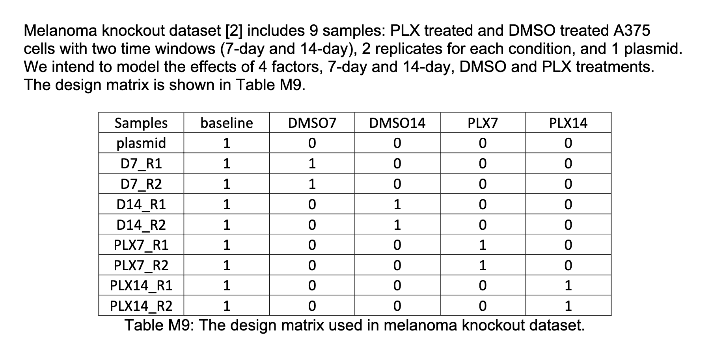
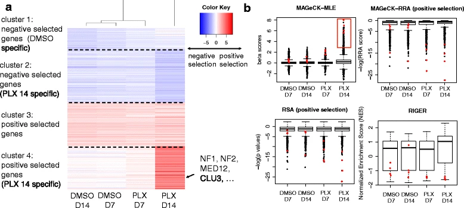

## MAGeCK-MLE: Essential Gene Detection

For some background, CRISPR [https://www.broadinstitute.org/what-broad/areas-focus/project-spotlight/questions-and-answers-about-crispr](Clustered%20Regularly%20Interspaced%20Short%20Palindromic%20Repeats) is a technology for gene editing (i.e. modifying selected parts of DNA). It consists of guiding RNA (gRNA), which both recognizes the target DNA sequence, and is also itself a target for the CRISPR-associated (cas) nuclease, which forms a ribonucleoprotein with the gRNA and performs a double-strand break on the DNA. This can result in a knockout or a knock-in of a gene.

Part of the use of CRISPR technologies is in the detection of essential genes within specific conditions.

One algorithm for doing this is the MAGeCK-MLE algorithm. This algorithm, using count data for all samples and genes, as well as a design matrix that establishes the various conditions of the gene, determines the a "gene selection score" for each that reflect how much each condition is selected for each gene.Let's look at a toy example.

### Toy Example

Say your data consists of 4 samples, 3 genes and 2 conditions (A and B). After read mapping you will have a count table,

```{r, echo=FALSE}
#| label: tbl-countTable
#| tbl-cap: "Count table. For each sample, each gene and each condition (first three columns) we have the number of reads for each gene g1, g2 and g3."
#| 
library(knitr)
df <- expand.grid(sample=c("a1","a2","b1","b2"))
df[df$sample %in% c("a1","a2"), "condition"] <- "A"
df[df$sample %in% c("b1","b2"), "condition"] <- "B"

df[df$sample %in% c("a1","a2"),"g1"] <- rpois(2,10)
df[df$sample %in% c("a1","a2"),"g2"] <- rpois(2,1000)
df[df$sample %in% c("a1","a2"),"g3"] <- rpois(2,1000)
df[df$sample %in% c("b1","b2"),"g1"] <- rpois(2,300)
df[df$sample %in% c("b1","b2"),"g2"] <- rpois(2,300)
df[df$sample %in% c("b1","b2"),"g3"] <- rpois(2,300)
countsTable <- df
kable(df[order(df$sample,df$condition),])
```

And we also have a design matrix that specifies how each sample and each condition are related:

```{r, echo=FALSE}
#| label: tbl-designmatrix
#| tbl-cap: "Design Matrix. For each sample (first column), we have beta0 for baseline abundance, beta1 for condition1, and beta2 for condition2."
df <- data.frame(sample=c("a1","a2","b1","b2"),
                  d0=c(1,1,1,1),
                  d1=c(1,1,0,0),
                  d2=c(0,0,1,1))

kable(df)
```

Each count $x$ we will model using a negative binomial distribution consisting of:

$$
  x \sim NB(u,\alpha)
$$ where $u=sq$ with $s=\frac{x}{\hat{x}}$ a size factor ($\hat{x}$ is the geometric mean for the sample), and $q$ reflects the design as follows:

```{r, echo=FALSE}
#| label: tbl-result
#| tbl-cap: "Intermediate Results Table. For each sample (first column), and each condition we have the gene counts, the geometric means for  we have beta0 for baseline abundance, beta1 for condition1, and beta2 for condition2."
dfX <- countsTable
geometricMeans <- apply(dfX[,c("g1","g2","g3")],2,function(x) { prod(x)^(1/length(x)) })
#dfX$geometricMeans <- geometricMeans
dfX$g1_s <- round(dfX$g1/geometricMeans[1],2) 
dfX$g2_s <- round(dfX$g2/geometricMeans[2],2)
dfX$g3_s <- round(dfX$g3/geometricMeans[3],2)
adjust <- function(x,values) {
  sapply(1:length(x), function(i) { 
    paste0("$$",round(x[i],2),values[i],"$$")
  })
}
dfX$g1_sq <- adjust(x=dfX$g1_s,values=c("e^{\\beta_{1,0}+\\beta _{1,1}}","e^{\\beta_{1,0}+\\beta_{1,0}}","e^{\\beta_{1,0}+\\beta_{1,2}}", "e^{\\beta_{1,0}+\\beta_{1,2}}"))
dfX$g2_sq <- adjust(x=dfX$g2_s,values=c("e^{\\beta_{2,0}+\\beta _{2,1}}","e^{\\beta_{2,0}+\\beta_{2,1}}","e^{\\beta_{2,0}+\\beta_{2,2}}", "e^{\\beta_{2,0}+\\beta_{2,2}}"))
dfX$g3_sq <- adjust(x=dfX$g3_s,values=c("e^{\\beta_{3,0}+\\beta _{3,1}}","e^{\\beta_{3,0}+\\beta_{3,1}}","e^{\\beta_{3,0}+\\beta_{3,2}}", "e^{\\beta_{3,0}+\\beta_{3,2}}"))

kable(dfX)
```

Finally, for counts table $X$ and design matrix $D$ we can calculate the likelihood as follows:

$$
\begin{aligned}
P(X,D|\beta_0,\beta_1,\beta_2) &= \sum NB(x|u,\alpha) \\
 &= \sum NB(9|0.18e^{\beta0+\beta1},\alpha) + \ldots + \sum NB(278|0.51e^{\beta0+\beta2},\alpha)
\end{aligned}
$$ where $\alpha$ is as defined in the paper and this can be estimated using maximum likelihood. Figure 1 shows a scatter plot of the likelihood estimates for gene 1 as a function of various values of $\beta_0$ and $\beta_1$ for gene1.

```{r,echo=FALSE}
#| label: fig-gene1
#| fig-cap: "3D Scatter Plot showing likelihood estimates for various values of beta1 and beta2 for gene 1. Actually the highest value (the MLE) is -23.44, which corresponds to beta1 4.3 and beta2 -3.1"
nb <- function(x,s,d0,d1,d2,beta0,beta1,beta2,dispersion) {
  mu <- s * exp(beta0*d0+beta1*d1+beta2*d2)
  dnbinom(x,size=dispersion,prob=mu/(mu+dispersion))
}


plotbetas <- function(dfX,beta0,beta1,beta2,dispersion) {
  do.call(rbind,lapply(1:nrow(dfX), function(i) {
    data.frame(log(nb(dfX[i,3],dfX[i,6],df[i,2],df[i,3],df[i,4],beta0,beta1,beta2,dispersion)),log(nb(dfX[i,4],dfX[i,7],df[i,2],df[i,3],df[i,4],beta0,beta1,beta2,dispersion)),
    log(nb(dfX[i,5],dfX[i,8],df[i,2],df[i,3],df[i,4],beta0,beta1,beta2,dispersion)))
  }))
}

x<-seq(-5,5,by=0.1)
r <- expand.grid(beta1=x,
                 beta2=x)
dispersion <-10
r$z <- sapply(1:nrow(r), function(i) { sum(plotbetas(dfX,0,r[i,"beta1"],r[i,"beta2"],dispersion=dispersion)[,1])
})
#r[which.max(r$z),]
library(plot3D)
r <- r[r$z!=-Inf,]
scatter3D(r$beta1,r$beta2,r$z,xlab="beta1",ylab="beta2",zlab="Likelihood")
```

### Mathematical Description

Following the notation and description from [@RN81]:

The read count, $x_{i,j}$ of a sgRNA $i$ targeting gene $g$ in sample $j$ is modeled with the Negative Binomial distribution,

$$
  x_{i,j} \sim NegBin(\mu_{i,j},\alpha_i)
$$

Note that this distribution is commonly used for gene counts as it allows a different mean and a different variance. The mean itself is modeled as:

$$
\mu_{i,j}=s_j q_{i,j}
$$ Where $s_j$ is a size factor accounting for the sequencing depth of the sample and is calculated as the number of counts divided by the geometric mean of the samples,

$$
s_j = \left( \frac{x_{i,j}}{\prod_{k=1}^{J}{x_{i,k}}} \right)^{(1/J)}
$$ On the other hand, $q_{i,j}$ corresponds to a linear combination of effects coming from the various conditions (drug types, cell types, etc) and they are specified as :

$$
\begin{equation}
\begin{cases}
  log(q_{i,j}) = \beta_0 + \sum_r d_{j,r} \beta_{g,r} & \text{if } \pi_i=1 \\
  log(q_{i,j}) = \beta_0  & \text{if } \pi_i=0
\end{cases}
\end{equation}
$$

where $d_{j,r}$ are elements of the design matrix. See example below. For $\beta>0$ $g_{i,r}$ is positively selected and $\beta<0$ is negatively selected in condition $g$ for gene $i$. $\beta_0$ is the initial sgRNA abundance measured in plasmid.

Ultimately, we want to maximize the likelihood, for a given set of counts $X=x_1 \ldots x_N$, genes $G=g_1 \dots g_G$, samples $S=s_1 \ldots s_S$ and design matrix $D$ we want to find the values of the parameters $\beta=\beta_0 \dots \beta_r$:

$$
P(x_{i,j}=x|\beta_0,\{\beta\},\pi_1,\pi_0) = \prod_{j=1}^J \left( P(x_{i,j}|\pi_i=0)P(\pi_i=0)+P(x_{i,j}|\pi_i=1)P(\pi_i=1) \right)
$$ \### Example

So let's use the example of [\@RN81](Li%20et%20al), all all the figures below are from that paper. In this case the design matrix would be something like this:

 Therefore, for each gene $g$ we would have the "gene essentiality scores" $\beta_{g,0}$, $\beta_{g,1}$, $\beta_{g,2}$, $\beta_{g,3}$, $\beta_{g,4}$ which would tell us how strongly this condition is present on the gene.

And we can see the results in the following figure:

 On Fig4.a we see each of the conditions on the x-axis and the genes on the y-axis, clustered into four groups.
