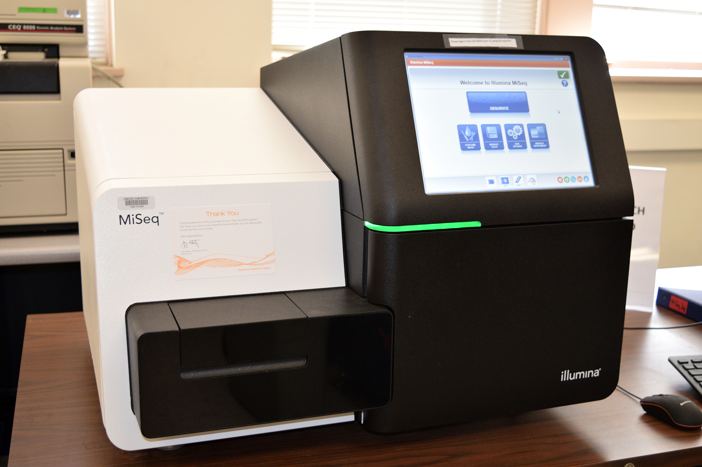
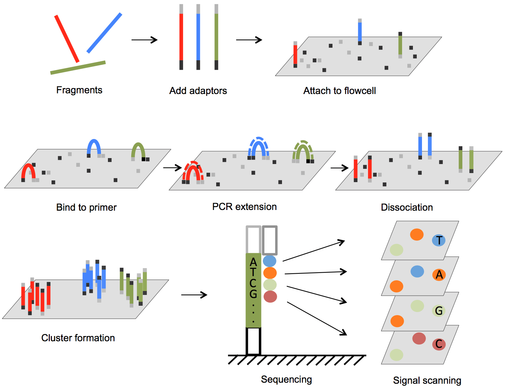
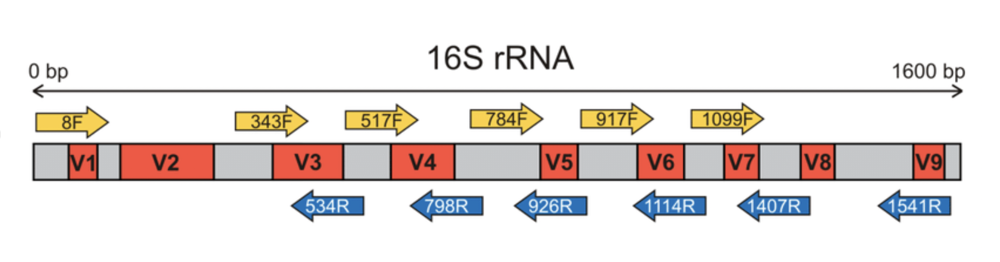

## The MiSeq: A Next Generation Sequencing Instrument

{width="50%" fig-align="left"}

The MiSeq, shown above, is one of several benchtop sequencers used in the Vermont Integrative Genomics Resource lab. The MiSeq uses next generation sequencing (NGS), which is a technology used to determine the sequence of DNA or RNA. As opposed to traditional Sanger sequencing using capillary electrophoresis, NGS can sequence many strands of DNA simultaneously, which means it can process and analyze data at a much faster rate. By sequencing multiple strands, NGS can more effectively compare data and identify genetic variants [@thermo]. The figure below shows a visual depiction of the NGS process, from DNA fragments to amplification and clustering to sequencing and analysis. With a runtime between 4 and 55 hours, the MiSeq outputs up to 15 Gb of data per run. The MiSeq performs up to 25 million reads per run, and its maximum read length is 2 x 300 base pairs [@illumina]. Common MiSeq applications include small genome sequencing, targeted gene sequencing, and 16S metagenomic sequencing.

{width="80%"}

Small genome sequencing involves analyzing the entire genome of small organisms such as microbes or viruses. A small genome contains less than or equal to 5 Mb of data. This information is especially useful for public health, epidemiology, or disease studies. The MiSeq can sequence up to 384 small genomes per run [@illumina].

Targeted gene sequencing analyzes a specific subset of genes or area of the genome, which is far more cost and time efficient than sequencing the entire genome. Sequencing is performed on amplicons, which are duplicated segments of DNA or RNA produced by polymerase chain reactions (PCRs). Hundreds to thousands of amplicons are sequenced per run, allowing the MiSeq to accurately identify genetic variation, including somatic mutations, insertions, deletions, single-nucleotide polymorphisms, and many more variants. The MiSeq can sequence up to 96 samples per run [@illumina].

16S metagenomic sequencing involves sequencing the 16S rRNA gene, which encodes for the 16S ribosomal RNA subunit of a prokaryotic ribosome. The figure below depicts the structure of this ancient gene, which is present in all bacteria and archea. It can be used to determine the phylogeny and taxonomy of bacteria and fungi in complex microbiomes and environments [@illumina16S]. Most commonly, the 16S gene is used to identify the species/genuses of bacteria present in a sample. The MiSeq can sequence up to 96 samples per run [@illumina].

{fig-align="left"}
