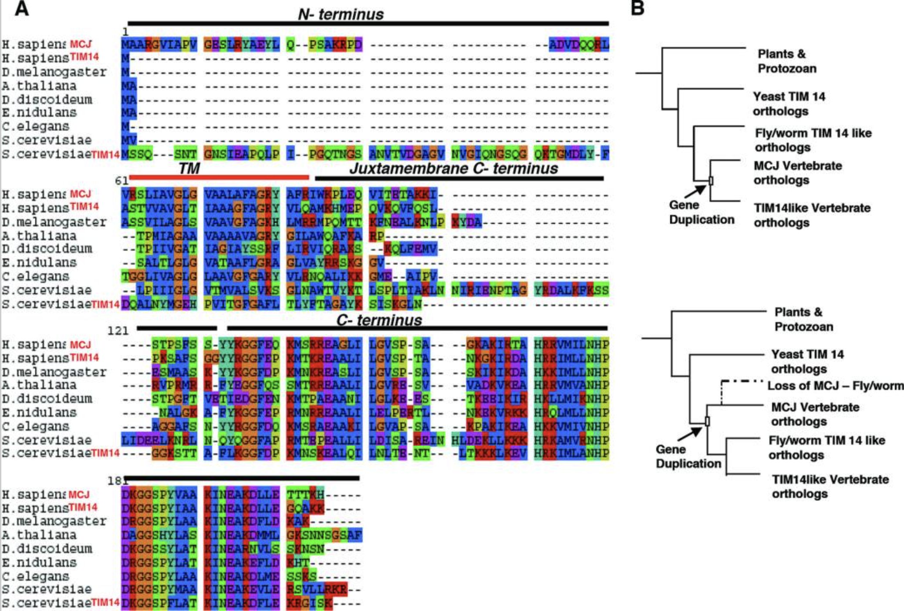

## Citation

Hatle, K.M., Neveu, W., Dienz, O., Rymarchyk, S., Barrantes, R., Hale, S., Farley, N., Lounsbury, K.M., Bond, J.P., Taatjes, D.J., & Rincon, M. (2007). [Methylation-Controlled J Protein Promotes c-Jun Degradation to Prevent ABCB1 Transporter Expression](https://pubmed.ncbi.nlm.nih.gov/17283040/). *Molecular and Cellular Biology*, 27(8), 2952-2966.

## Summary

This work with MCJ has a very interesting story behind it, but I need to ask for Dr. Mercedes for permission to share it here. But in this work, experimentally Ketki showed that 1) MCJ is required in order to prevent c-Jun mediated ABCB1 expression: if MCJ is absent, c-Jun increases and ABCB1 gets expressed more and 2) inhibition of MCJ expression increases resistance to certain drugs. Finally, we also showed that MCJ only exists in vertebrates and found that gene duplication was part of its history.

## My Role

For this work I collaborated with Ketki Hatle in the lab of Dr. Mercedes Rincón, and I did phylogenetic analysis of MCJ, we used a classical approach of sequence similarity search, alignment and a phylogeny, as well as establishing confidence using bootstrapping and also posterior probability.

{alt="Figure 1: Phylogenetic analysis and sequence alignment of MCJ." fig-align="center"}
