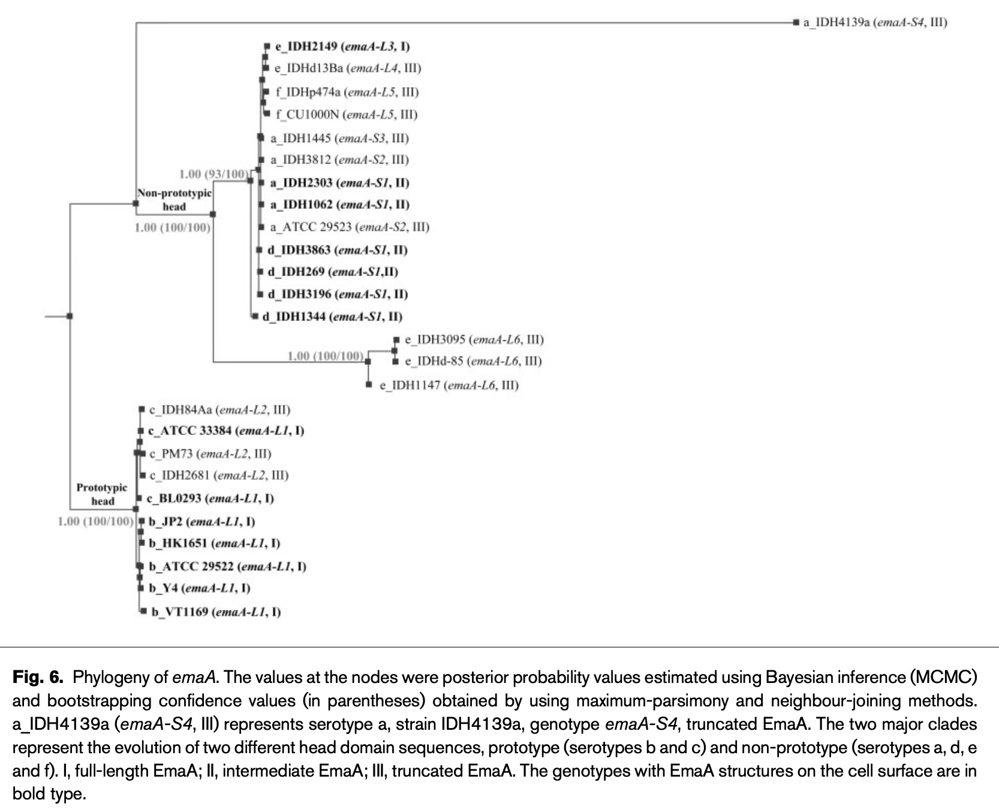

## Citation

Tang, G., Ruiz, T., Barrantes-Reynolds, R., & Mintz, K.P. (2007). [Molecular Heterogeneity of EmaA, an Oligomeric Autotransporter Adhesin of *Aggregatibacter Actinomycetemcomitans*](https://pubmed.ncbi.nlm.nih.gov/17660409/). *Microbiology*, 153(Pt 8), 2447-2457.

## Summary

This paper was about EmaA in a gram-negative bacteria strongly liked to disease in the mouth. We worked with 27 strains encompassing the six serotypes and identified three emaA, which were characterized. I did the phylogenetics which lead to further characterize the population structure.

