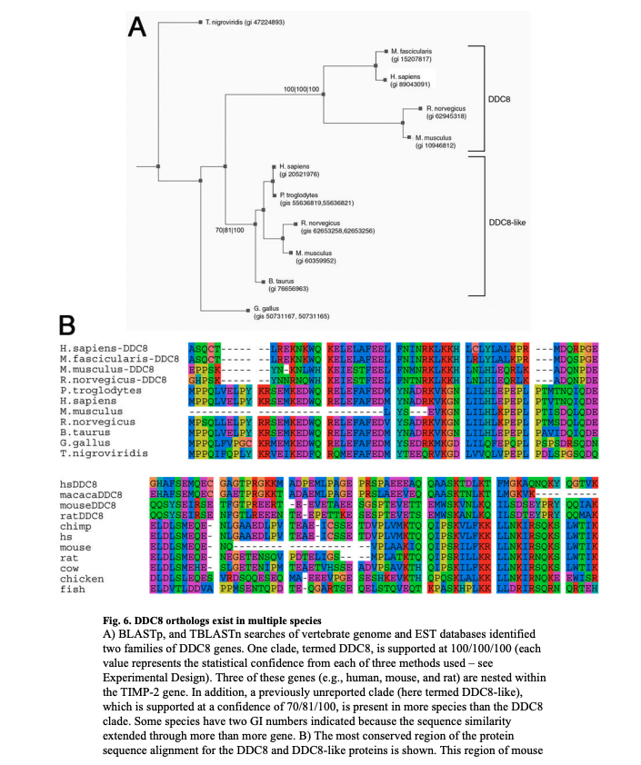

## Citation

Jaworski, D.M., Beem-Miller, M., Lluri, G., & Barrantes-Reynolds, R. (2007). [Potential Regulatory Relationship Between the Nested Gene DDC8 and Its Host Gene Tissue Inhibitor of Metalloproteinase-2](https://pubmed.ncbi.nlm.nih.gov/16985004/)

## Summary

Here I worked with investigator Diane Jaworski and did basic bioinformatics: sequence alignment, phylogenetic analysis and discovered a gene duplication event. On the experimental side we discovered that the DDC8 and the TIMP-2 seem to be related in their regulation and perhaps even are a product of alternative splicing.

