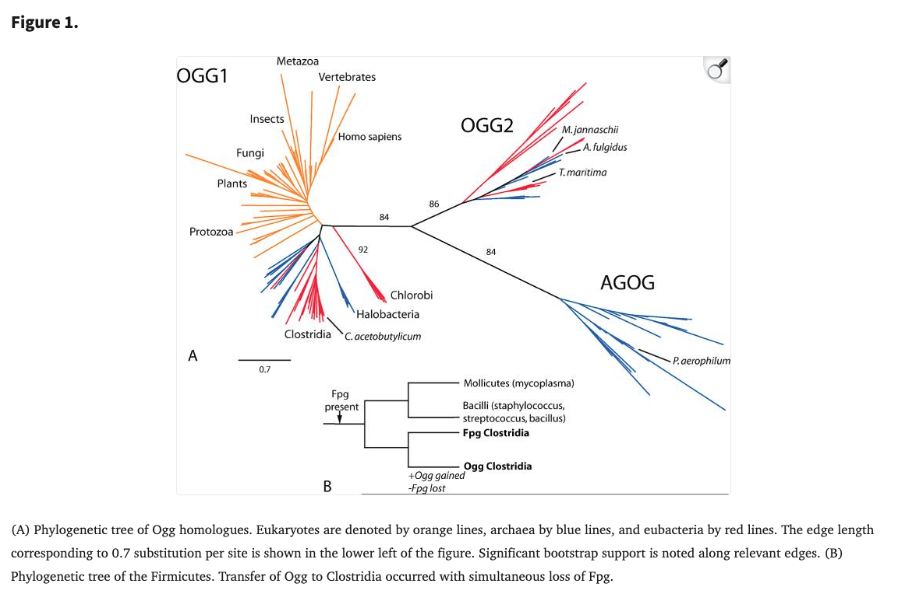

## Citation

Robey-Bond, S.M., Barrantes-Reynolds, R., Bond, J.P., Wallace, S.S., & Bandaru, V. (2008). [Clostridium Acetobutylicum 8-Oxoguanine DNA Glycosylase (Ogg) Differs from Eukaryotic Oggs with Respect to Opposite Base Discrimination.](https://pmc.ncbi.nlm.nih.gov/articles/PMC2574669/) *Biochemistry*, 47(29), 7626-7636.

## Summary

This was my entry into the fascinating world of DNA repair, an ancient system seemingly as old as life which keeps our DNA whole. Over time enzymes have specialized, and the Ogg enzymes repair the 8-Oxoguanine damage, a common DNA lesion caused by oxidative damage. This study characterizes the bacterial Ogg from *Clostridium acetobutylicum*. For this analysis I identified homologues using conserved domain profiles, performed sequence alignment, and phylogenetic trees.

[{fig-align="center"}](https://pmc.ncbi.nlm.nih.gov/articles/PMC2574669/)
