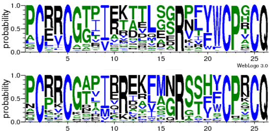

## Citation

Pumo, D.E., Barrantes-Reynolds, R., Kathe, S.D., Wallace, S.S., & Bond, J.P. (2010). DNA Repair Mechanisms and Genomic Instability. In [*Genome Instability and Transgenerational Effects* (pp. 71-88](https://www.amazon.com/Genome-Instability-Transgenerational-Effects-Genetics/dp/1608768317). Kovalchuk, I. & Kovalchuk, O. (Eds.), Nova Science Publishers, Inc., New York.

## Summary

This book chapter provides a review of DNA repair mechanisms and their role in maintaining genome stability. It summarized the evolutionary knowledge at the time and I worked with Dorothy Pumo and we proposed a hypothesis for how these enzymes evolved.

