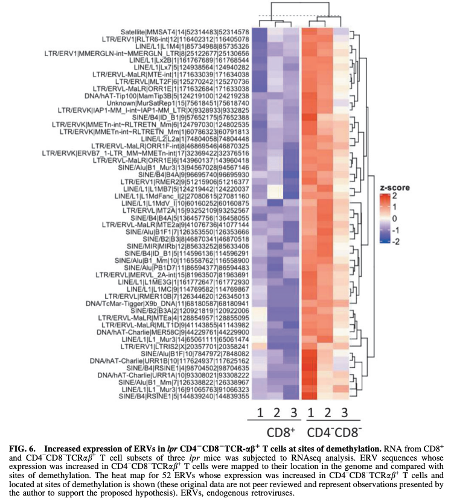

## Citation

Budd, R.C., Scharer, C.D., Barrantes-Reynolds, R., Legunn, S., & Fortner, K.A. (2022). [T Cell Homeostatic Proliferation Promotes a Redox State That Drives Metabolic and Epigenetic Upregulation of Inflammatory Pathways in Lupus.](https://pubmed.ncbi.nlm.nih.gov/34328790/) *Antioxidants & Redox Signaling*, 36(7-9), 410-422.

## Summary

In this work Ralph, an M.D. proposes a hypothesis of the many abnormalities that we see in lupus patients: homeostatic proliferation of T-cells. In our genome we actually have ancient remnants of viruses, which are called endogenous retroviruses (ERVs). Part of my contribution was analyzing RNA expression at genomic sites that were both demethylated and located within ERVs, specifically in CD4⁻CD8⁻TCRαβ⁺ T cells. The figure below shows that these sites are more highly expressed in CD4⁻CD8⁻TCRαβ⁺ T cells compared to conventional T cells — consistent with the hypothesis that homeostatic proliferation drives ERV reactivation through demethylation.

