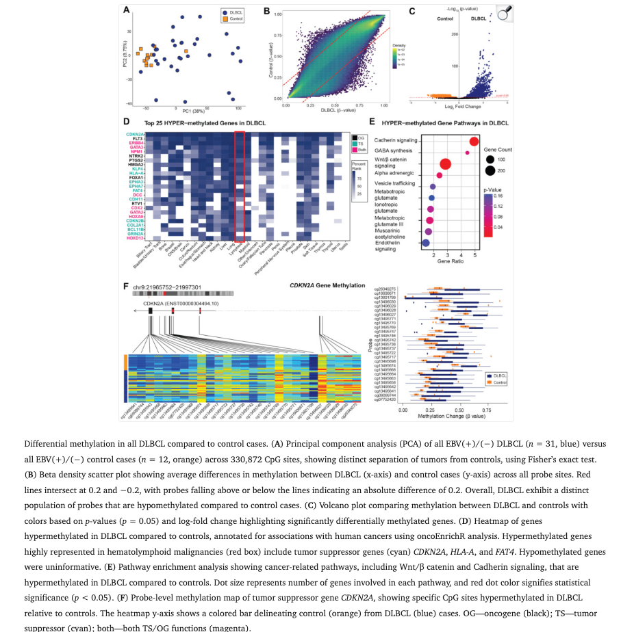

## Citation

Volaric, A.K.; Barrantes-Reynolds, R.; Sahakyan, K.; Fedoriw, Y.; Frietze, S. (2025). [The EBV-Positive Tumor Methylome Is Distinct from EBV-Negative in Diffuse Large B-Cell Lymphoma.](https://pubmed.ncbi.nlm.nih.gov/41008837/) *Cancers*, 14(2), 299.

## Summary

This was my first published paper after returning to work full time to the University of Vermont as part of the Translational Global Infectious Disease Research (TGIR).This study investigates the epigenetic landscape of EBV-positive diffuse large B-cell lymphoma (DLBCL), comparing methylation patterns between EBV-positive and EBV-negative cases. Here I had the pleasure of working closely with Doctor Ashley Volaric, we had a set of tumor samples and controls - unfortunately, due to the type of cancer - it is not feasible to obtain tumor/normal pairs from the same patient. I performed an extensive epigenetic analysis from on illumina Epic V2 data and indeed, we identified a distinct and extensive hypermethylation signature in EBV-positive tumors.

