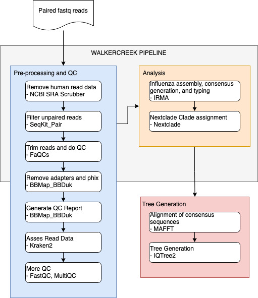

## Citation

Turner, A.H., Jaffrani, S.A., Kubinski, H.C., Ajayi, D.P., Owens, M.B., Fanuele, C.D., McTigue, M.P., Appenzeller, C.L., Bowling, A., Despres, H.W., Schmidt, M.M., Shirley, D.J., Crothers, J.W., **Barrantes-Reynolds, R.**, & Bruce, E.A. (2026). [Rab11B is required for binding and entry of recent H3N2, but not H1N1, influenza A isolates.](https://pubmed.ncbi.nlm.nih.gov/42227759/) *Journal of Virology*, e0211125. https://doi.org/10.1128/jvi.02111-25

## Summary

Influenza A virus (IAV) is a major human pathogen that relies on host cellular machinery for successful infection and replication. This study revealed a subtype-specific difference for Rab11B: recent H3N2 isolates require Rab11B for efficient binding and entry into human lung cells, whereas H1N1 isolates do not depend on Rab11B at this stage of infection. all of this suggests that H1N1 and H3N2 enter human lung cells via different routes.

Here I had to do some research and found the [Walkercreek pipeline](https://github.com/UPHL-BioNGS/walkercreek) which was a nextflow pipeline developed by a Samuel Shepard and others at the CDC and is used for typing influenza viruses. To this I added an alignment and tree generation component using nextflow which was used by the investigators to type the viruses, as well as an RShiny app that was used for visualizing and comparing the results.

